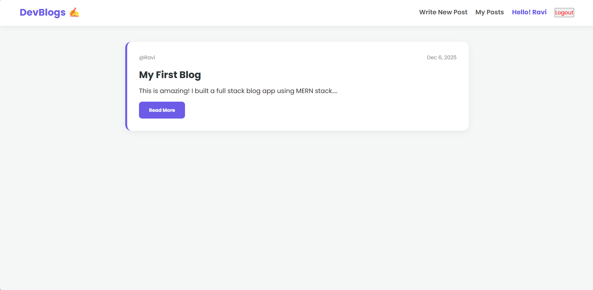
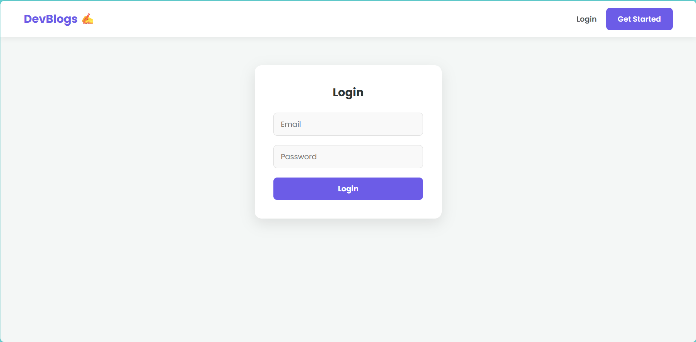
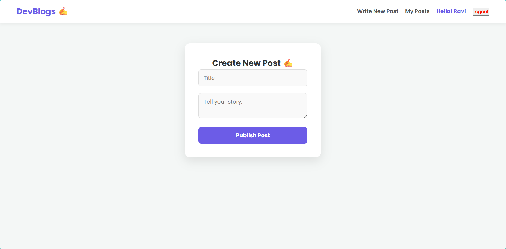

# 📝 Blog Management System (DevBlogs)

**Cognetix Technology Internship - Intermediate Level Task 1**

A full-stack MERN (MongoDB, Express, React, Node.js) web application that allows users to register, authenticate, and manage their own blog posts. This project demonstrates CRUD operations, JWT authentication, and state management using React Context API.

## 🚀 Features

* **User Authentication:** Secure Sign Up and Login functionality using JWT (JSON Web Tokens).
* **Create Posts:** Authenticated users can write and publish new blog articles.
* **Read Feeds:** A public home page displaying all blog posts from various authors with timestamps.
* **Manage Posts:** Users have a personalized dashboard to view and delete their own posts.
* **Security:** Password hashing using bcryptjs and protected routes.
* **Responsive UI:** Clean and modern interface designed with CSS and React.

## 🛠️ Tech Stack

**Frontend:**
* React.js
* Context API (State Management)
* Axios (HTTP Client)
* React Router DOM (Routing)

**Backend:**
* Node.js
* Express.js
* MongoDB (Database)
* Mongoose (ODM)

**Authentication:**
* JSON Web Tokens (JWT)
* Bcryptjs

## ⚙️ Installation & Setup Guide

Follow these steps to run the project locally on your machine.

### Prerequisites
* Node.js installed
* MongoDB installed locally or a MongoDB Atlas account

### 1. Clone the Repository
```bash
git clone [https://github.com/ravikumar-8/Cognetix_blog-management-system.git](https://github.com/ravikumar-8/Cognetix_blog-management-system.git)
cd Cognetix_blog-management-system 
```

### 2. Backend Setup
Navigate to the backend folder and install dependencies.
```bash
cd backend
npm install
```
### Configuration:Create a .env file in the backend folder and add the following variables:
```bash
Code snippetMONGO_URI=mongodb://127.0.0.1:27017/blog_db
JWT_SECRET=your_super_secure_secret_key_123
PORT=5000
```
Start the Server:
```Bash
npm run dev
# OR
node server.js
The backend will run on http://localhost:5000
```
### 3. Frontend Setup
Open a new terminal, navigate to the frontend folder, and install dependencies.
```Bash
cd ../frontend
npm install
```

### Start the React App:
```Bash
npm start
```
The frontend will run on http://localhost:3000


### 🔌 API Endpoints
bash
| Method | Endpoint | Description | Access |
|--------|:---------|:-----------:|-------:|
|POST|/api/auth/register|Register a new user|Public|
|POST|/api/auth/login|Login user & return Token|Public|
|GET|/api/posts|Get all blog posts|Public|
|POST|/api/posts/create|Create a new blog post|Private (Auth)|
|GET|/api/posts/my-posts/:userId|Get posts belonging to a user|Private (Auth)|
|DELETE|/api/posts/:id|Delete a specific post|Private (Auth)|

## 📸 Screenshots
### Home Page

### Login Page

### Create Post Page


## 👨‍💻 Author
### Ravi Kumar 
* Role: Full Stack Developer Intern
* GitHub: ravikumar-8

Submitted as part of the Cognetix Technology Internship Program.
